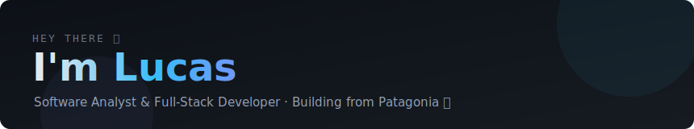

<!-- Header SVG — guardado como assets/header.svg en tu repo -->

  

---

### About me

I build **mobile apps and web platforms** that solve real-world problems — from custom order management tools for small businesses to AI-powered emotional support systems. I care about clean architecture, smooth UX, and products that actually get used.

- 📍 Based in **Punta Arenas, Chile**
- 🛠️ Current stack: **Flutter · Vue.js · Laravel · Firebase · Supabase**
- 🤖 I integrate AI APIs (OpenAI, Gemini) into real, shipped products
- 🎯 Goal: generate income through my own projects and level up in mobile development

---

### 🔨 What I'm building now

| Project | Stack | Status |
|---|---|---|
| **Aluria** — AI-powered mental wellness app | Flutter · Firebase · OpenAI | 🟢 Active |
| **Servizly** — SaaS for custom-order businesses | Next.js · Supabase | 🟢 Active |
| **PetSocial** — Pet-focused social network | React Native · Supabase | ✅ MVP shipped |

---

### 🧰 Tech Stack

**Mobile**

**Frontend**

**Backend**

**Cloud & DB**

---

### 💡 What I focus on

- 📱 **Cross-platform mobile apps** with monetization built in from day one
- 🤖 **AI integration** — connecting LLMs to real products, not just prototypes
- 🚀 **SaaS products** — MVPs, referral systems, onboarding, retention
- ⚙️ **Automation** — Python bots, web scraping, task optimization

---

### 🤝 Open to collaborate on

- Social impact apps
- Mental health & wellness projects
- Startup MVPs and rapid prototyping

---

### 📬 Get in touch

